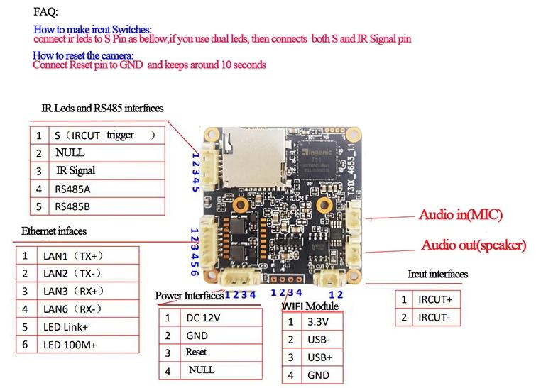

# AKA IP Camera Module CH-T31

- [Devices](devices.md)

---

- [Starlight Wireless IP Camera Module](https://aliexpress.ru/item/32964731240.html?sku_id=12000018268840500)
    - Brand Name: AKA 🚧
    - Model Number: CH-T31 🚧
    - CPU: Ingenic T31L
    - Sensor: Galaxycore GC2083
    - Flash: 8MB NOR
    - U-Boot password: HI2105CHIP
    - Seller: [Marviosafer Store](https://aliexpress.ru/store/1758182?g=y&page=1&searchInfo=search&spm=a2g2w.detail.0.0.1dbe690aNfoWG0)
    - Price: 1508 ₽ (25.04.2024)



- UART: 1-TX, 2-GND, 3-RX


## Majestic settings
### Night Mode

```
.nightMode.colorToGray: true
.nightMode.irCutPin1: 58
.nightMode.irCutSingleInvert: false
.nightMode.irCutPin2: 57
.nightMode.backlightPin:
.nightMode.overrideDrc:
.nightMode.lightMonitor: true
.nightMode.lightSensorPin:
.nightMode.lightSensorInvert: false
.nightMode.monitorDelay: 20
.nightMode.minThreshold: 60
.nightMode.maxThreshold: 120
.nightMode.adcReadout: false
```